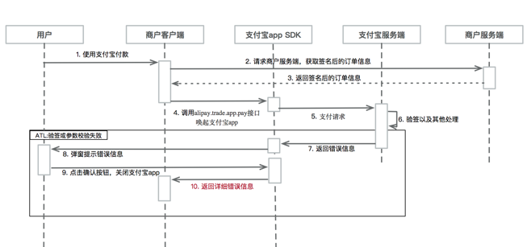
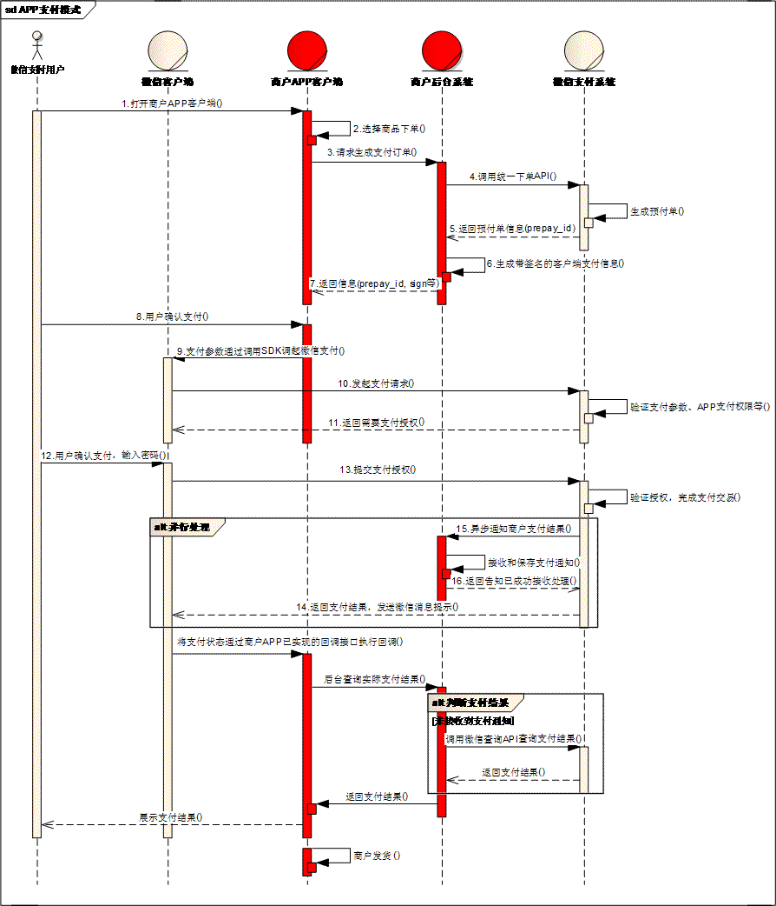

# 支付接入

> 支持 微信支付，支付宝支付


## 支付流程

1. 创建自己的订单，使用 `App` 内的产品 `Id` 在自己的服务器创建订单，并返回 `orderId`。
2. 使用 `orderId` 向服务器发起支付请求，服务器会使用该 `orderId` 去 微信/支付宝 服务器生成预支付订单，并将信息返回客户端。
3. 客户端获取到预支付订单信息，支付宝是一个签名串，微信是一个 `Map` 结构，使用这些信息在用户端发起支付请求。
4. 支付成功去服务端查询支付结果。


## 发起微信支付

微信支付通常使用一个 `Map` 进行参数传递，应该包含一下几个 `Key`；

```java
Map<String, String> wxParams = new HashMap<>();

private static final String APP_ID     = "appid";
private static final String PACKAGE    = "package";
private static final String PARTNER_ID = "partnerid";
private static final String PREPAY_ID  = "prepayid";
private static final String NONCE_STR  = "noncestr";
private static final String TIME_STAMP = "timestamp";
private static final String SIGN       = "sign";
```

发起支付，`appId` 不是必须的，可以放在 `wxParams` 里面通过服务端传递过来。

```java
String wxAppId = activity.getString(R.string.wx_pay_app_id);
Map<String, String> wxParams = new HashMap<>();
PaySdk.payWx(activity)
        .params(wxParams)
        .appId(wxAppId)
        .listener(new OnPayListener() {
            @Override
            public void onSuccess() {

            }
            @Override
            public void onFailure(PayError error) {

            }
            @Override
            public void onCancel() {

            }
        })
        .pay();
```

## 发起支付宝支付

支付宝支付使用的是支付宝返回的签名字符串，签名字符串中已经包含了 `appId` 因此也不必配置 `appId`。


```java
String aliPaySignStr = "";
PaySdk.payAli(activity)
        .params(PaySdk.KEY_ALI_PARAMS, aliPaySignStr)
        .listener(new OnPayListener() {
            @Override
            public void onSuccess() {

            }
            @Override
            public void onFailure(PayError error) {

            }
            @Override
            public void onCancel() {

            }
        })
        .pay();
```

## 支付宝支付流程



## 微信支付流程

